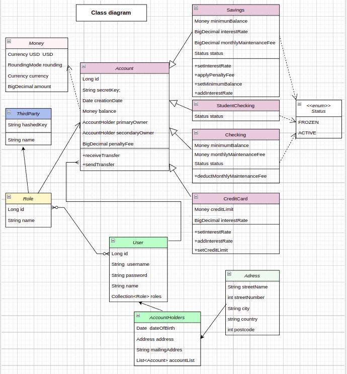
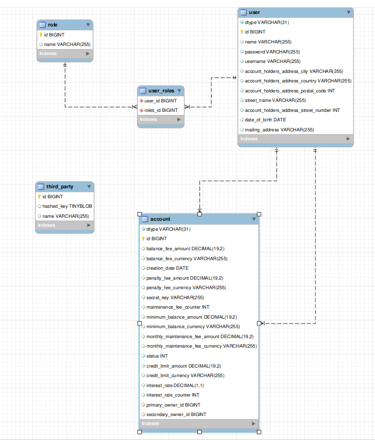
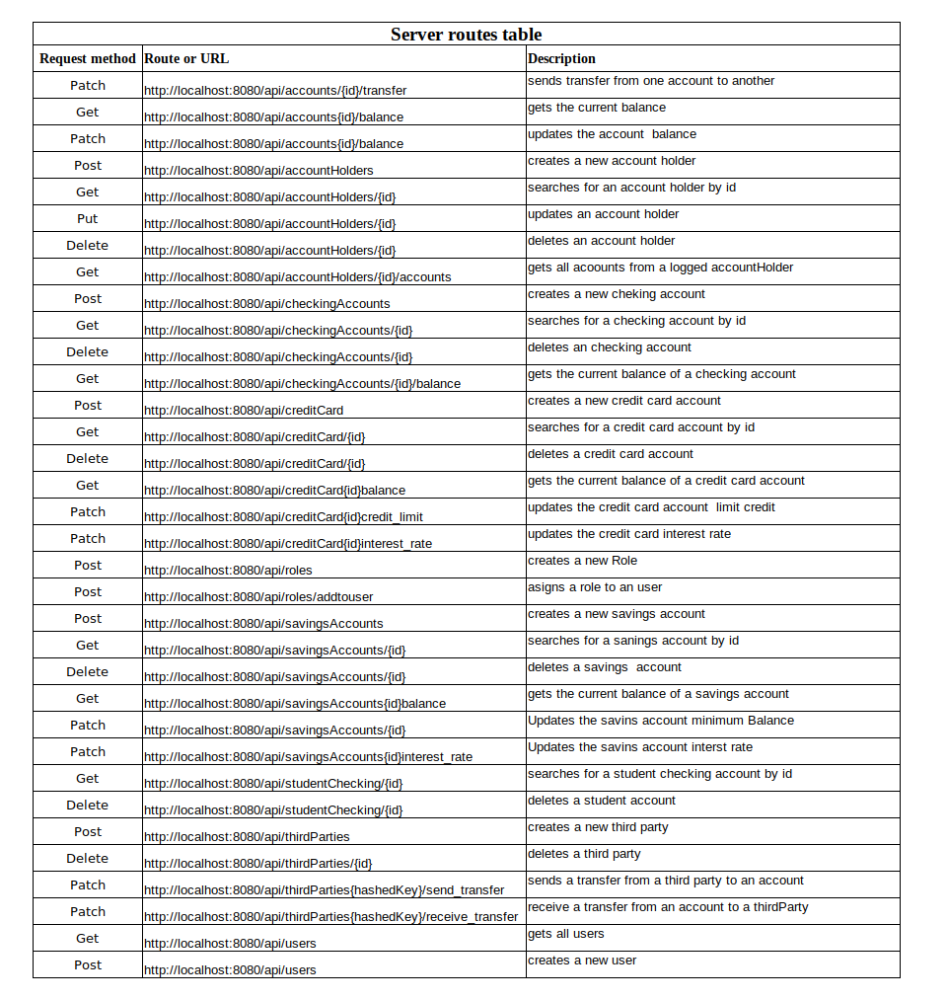

# Openbank-project

The OPENBANK project consists of an API REST for online banking.
In this API there are three different profiles with different options each. These profiles are:
Admins: this profile has most of the access privileges. They can create a  new account, delete an account, access the balance of any account, and modify it. They also can create a new account holder profile, or a new third-party profile and delete it.
Account holder: this profile is the owner of a bank account, but this ownership it’s not limited to just one bank account. They can also be the secondary owner of another account. This profile has only permissions access to the account balance where they are the primary or secondary owner.  They also can send transfers to other accounts.
Third-party: this profile can only transfer and receive money to one bank account through a validated hash key.
The following diagram explain the operability of the API.

### Class diagram:

### DB Model:

### Technologies Used:
<ul>
<li>Java/Spring Boot for API development.</li>
<li>MySQL as database./li>
<li>Postman to design, build, test, and iterate the API./li>

### Server routes table

### Resourses
> https://www.baeldung.com/  
https://docs.jboss.org/hibernate/stable/validator/api/
